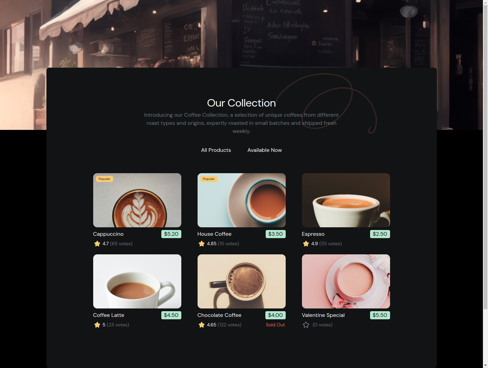

<!-- Please update value in the {}  -->

<h1 align="center">Coderalchemy | devChallenges</h1>

   Solution for a challenge <a href="https://devchallenges.io/challenge/simple-coffee-listing" target="_blank">Simple Coffee Listing</a> from <a href="http://devchallenges.io" target="_blank">devChallenges.io</a>.

  <h3>
    <a href="https://tourmaline-flan-f02d6b.netlify.app/">
      Demo
    </a>
     | 
    <a href="https://github.com/CoderAlchemy24/dch-coffeelist.git">
      Solution
    </a>
     | 
    <a href="https://devchallenges.io/challenge/simple-coffee-listing">
      Challenge
    </a>
  </h3>

<!-- TABLE OF CONTENTS -->

## Table of Contents

- [Overview](#overview)
- [Built with](#built-with)
- [Features](#features)

<!-- OVERVIEW -->

## Overview

### Built with

<!-- This section should list any major frameworks that you built your project using. Here are a few examples.-->

- Semantic HTML5 markup
- CSS custom properties
- Flexbox

- [React](https://reactjs.org/)
- [Tailwind](https://tailwindcss.com/)

## Features

<!-- List the features of your application or follow the template. Don't share the figma file here :) -->

This application/site was created as a submission to a [DevChallenges](https://devchallenges.io/challenges-dashboard) challenge.

## Author

- GitHub [@coderAlchemy24](https://github.com/coderAlchemy24)
